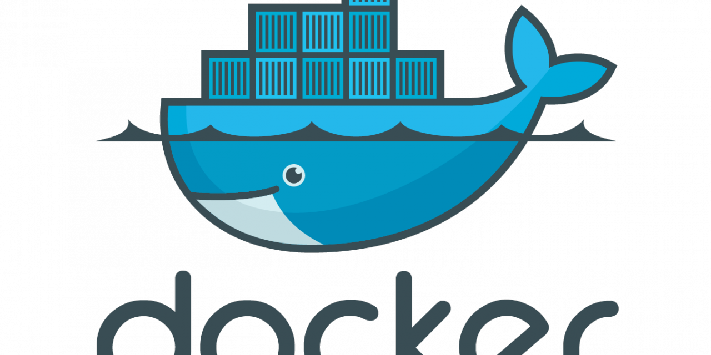

 

# Scripts for Docker DTR API v0
<p align="center">
	
</p>

## Description
- Create repository in your Docker Trusted Registry
- create organizations, add to users and role

## Usage script
```$ ./createNameSpace.sh -a UserAdminDTR -p PassUserAdminDTR -n NameSpace -u UserNameSpace```

## Usage docker
### First building image docker container
```$ docker build -t example:1.0 .```
### Run
```$ docker run -v /path/log/file/host:/tmp example:1.0 -a userAdmin -p YourPassUserAdmin -n helloworld -u user1"'"```
### From Kubernetes
```ssh root@IP_CLUSTER -t -p 22 "'"createNameSpace.sh -a userAdmin -p YourPassUserAdmin -n helloworld -u user1"'"```

